<div align="center">


# Trade Marketing HiperRoll

**Painel web para gestão de visitas a lojas, controle de rupturas, planejamento de rotas e acompanhamento de pedidos.**


<br>

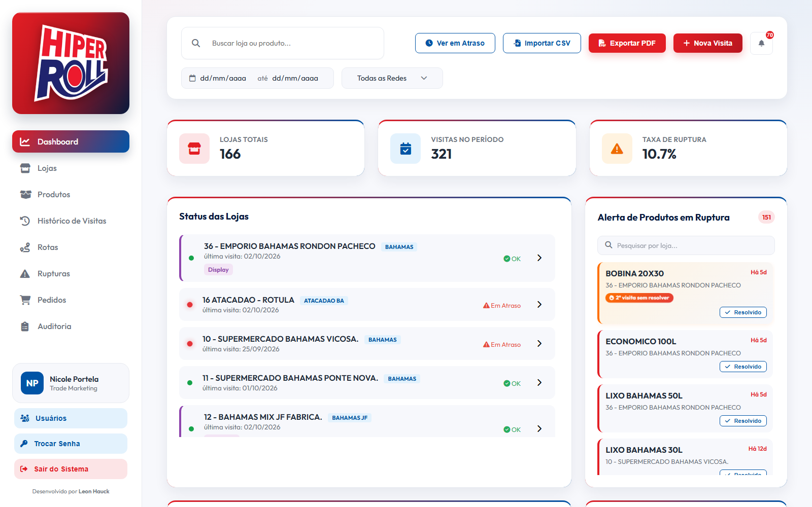

</div>

---

## Sumário

- [Visão geral](#visão-geral)
- [Telas do sistema](#telas-do-sistema)
- [Funcionalidades](#funcionalidades)
- [Arquitetura](#arquitetura)
- [Tecnologias](#tecnologias)
- [Estrutura do projeto](#estrutura-do-projeto)
- [Como executar localmente](#como-executar-localmente)
- [Publicação em produção](#publicação-em-produção)
- [API do backend](#api-do-backend)
- [Segurança](#segurança)
- [Solução de problemas](#solução-de-problemas)
- [Autor e licença](#autor-e-licença)

---

## Visão geral

O **Trade Marketing HiperRoll** centraliza a rotina da equipe de trade marketing da HiperRoll Embalagens em um único painel:

- registra as **visitas** feitas às lojas das redes varejistas atendidas, com fotos, pontos extras e observações;
- acompanha cada **ruptura** (produto em falta na gôndola) desde a identificação até a resolução;
- sinaliza lojas **em atraso** de acordo com a frequência de visita combinada;
- sugere **rotas semanais** para os promotores, priorizando o que é mais urgente;
- controla **pedidos comerciais** por cliente, loja e datas de agendamento e entrega;
- exporta tudo em **CSV e PDF**, respeitando os filtros aplicados na tela.

A aplicação é um front-end em JavaScript puro, sem etapa de build, com um backend PHP enxuto que grava os dados em arquivos JSON — o que permite hospedar em qualquer plano de hospedagem compartilhada, sem banco de dados.

| Em números | |
|---|---|
| Lojas cadastradas | 166, em 7 redes |
| Produtos monitorados nas visitas | 25 |
| Catálogo comercial (aba Pedidos) | 194 itens |
| Lojas com coordenadas para rotas | 100% |

---

## Telas do sistema

> As imagens abaixo foram geradas com **visitas, rupturas, pedidos e usuários fictícios**, apenas para demonstração. Nenhum dado operacional real aparece nelas.

### Acesso

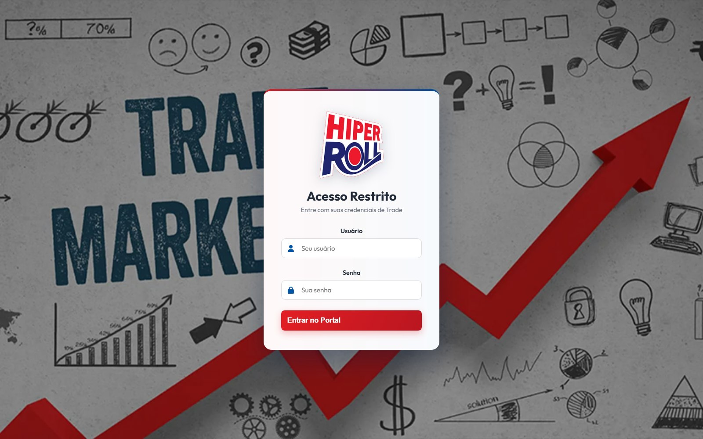

Cada pessoa entra com o próprio usuário. O administrador cadastra os demais na janela **Usuários**, com nome, cargo e senha inicial; o nome e o cargo de quem está logado aparecem na barra lateral e no cabeçalho dos PDFs exportados.

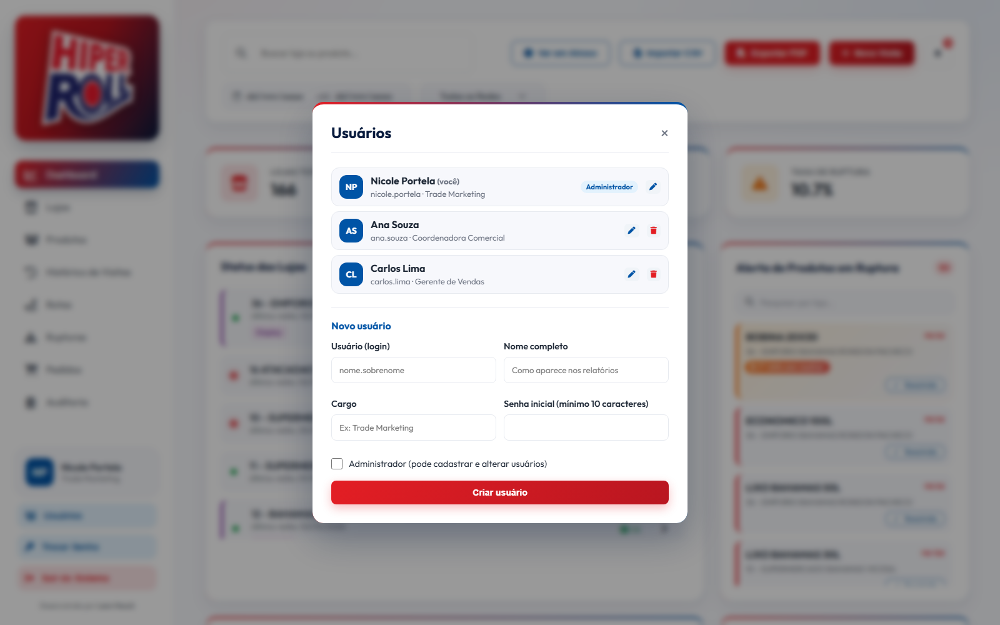

### Dashboard

Indicadores do período, status de cada loja (em dia, pendente ou em atraso) e a lista de produtos em ruptura, com destaque para o que continua sem solução após a segunda visita.


### Lojas

Cartões com rede, frequência de visita, pontos extras e status. Filtros por rede, status e período, com exportação em CSV e PDF.

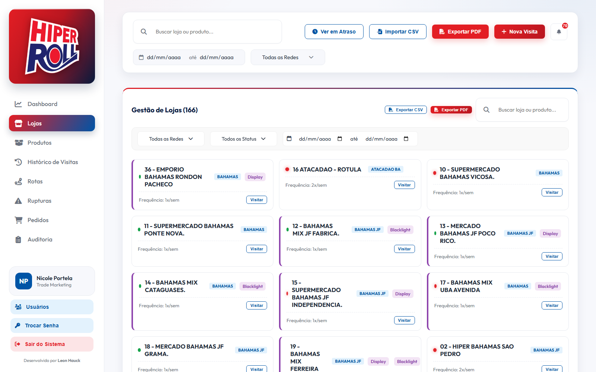

### Produtos

Ranking de rupturas por produto, com o total de ocorrências e a quantidade de lojas afetadas.

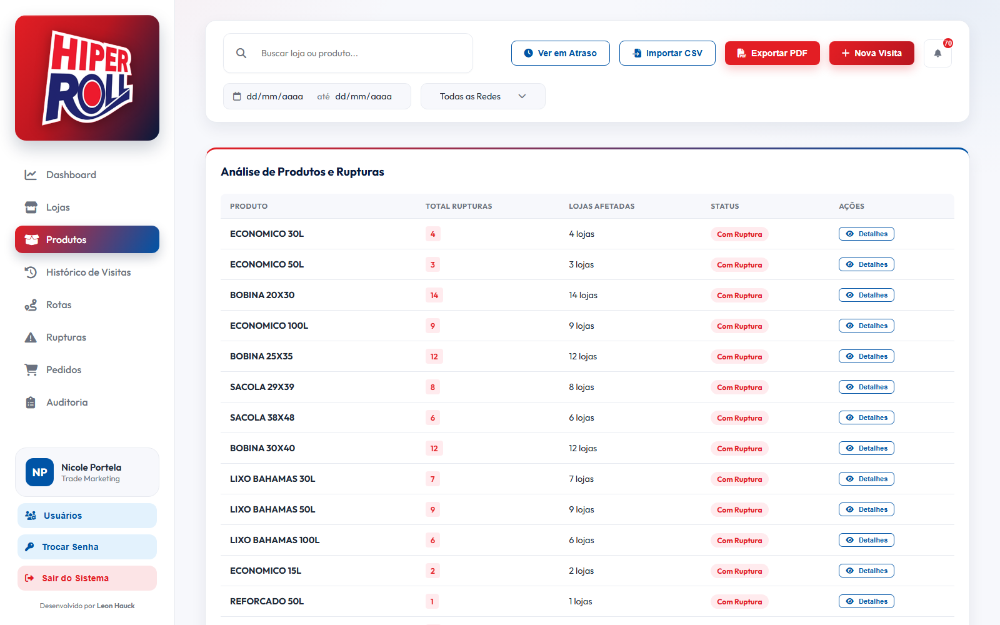

### Histórico de Visitas

Todas as visitas registradas, com filtros combináveis por texto, período, rede, produto, ponto extra, observação, visita extra e ruptura. É possível editar, excluir (inclusive em lote) e exportar o resultado filtrado.

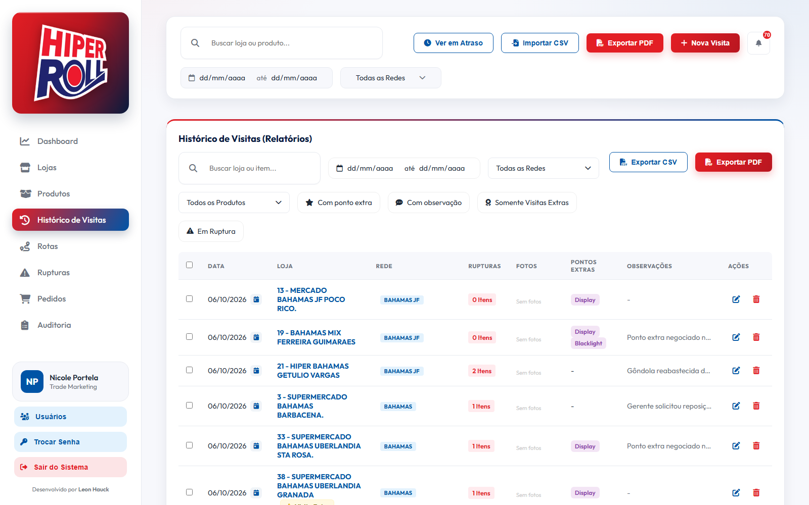

O **filtro por produto** mostra somente as visitas em que o item selecionado ainda está pendente — se a ruptura já foi resolvida, a visita não aparece.

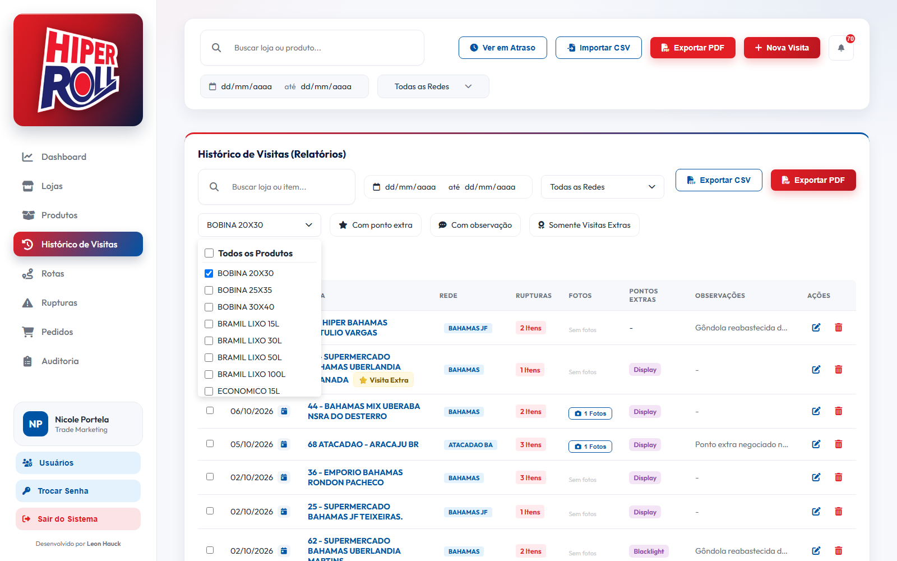

<table>
<tr>
<td width="50%" valign="top">

**Detalhes da visita**

Progresso de resolução, situação de cada item e as demais visitas feitas à mesma loja.

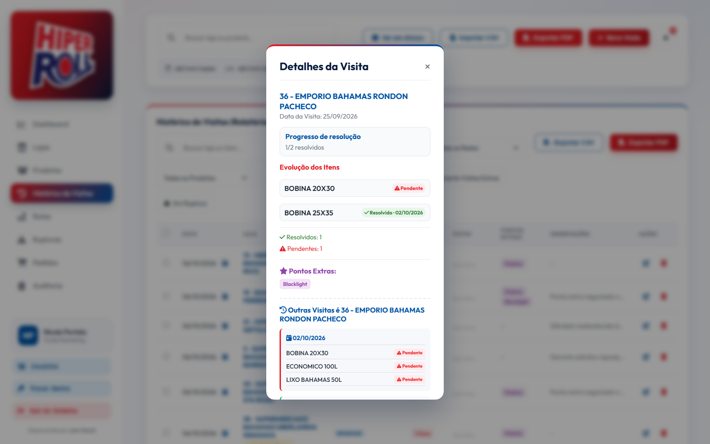

</td>
<td width="50%" valign="top">

**Registrar visita**

Checklist dos produtos da loja, lembrete das rupturas da última visita, pontos extras, fotos e observações.

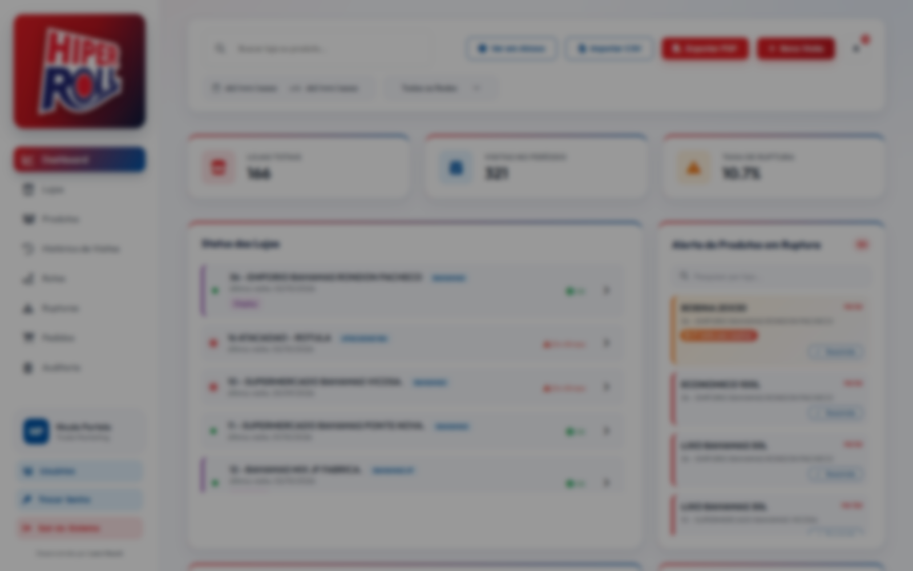

</td>
</tr>
</table>

### Rotas

Plano semanal por promotor, com horário estimado de cada parada, tempo total do dia e atalho para abrir o trajeto no Google Maps.

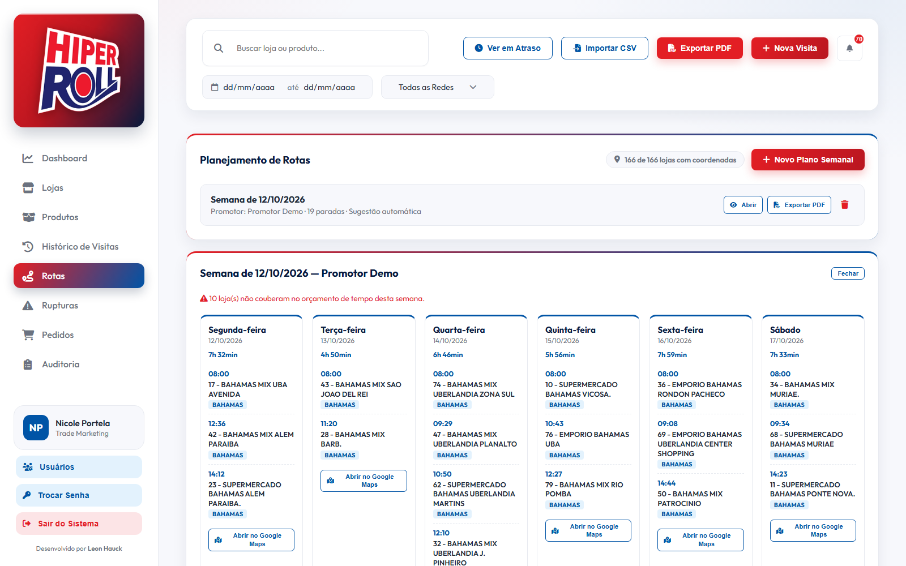

### Rupturas

Histórico completo de visitas e de rupturas já resolvidas, com o status de cada visita (pendente, parcial ou resolvida).

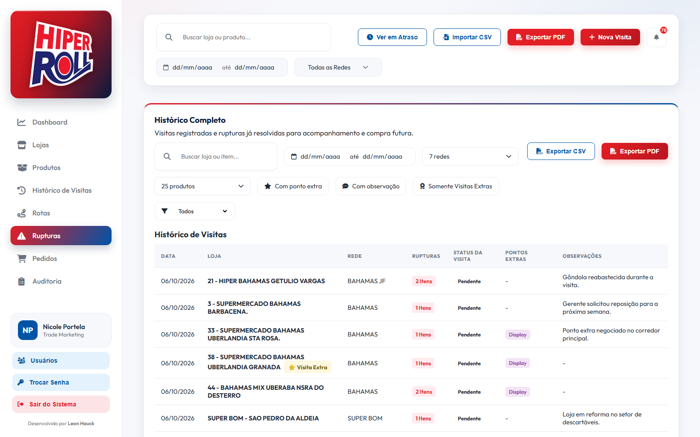

### Pedidos

<table>
<tr>
<td width="50%" valign="top">

**Lista de pedidos**

Filtros por rede, cliente, número do pedido e período.

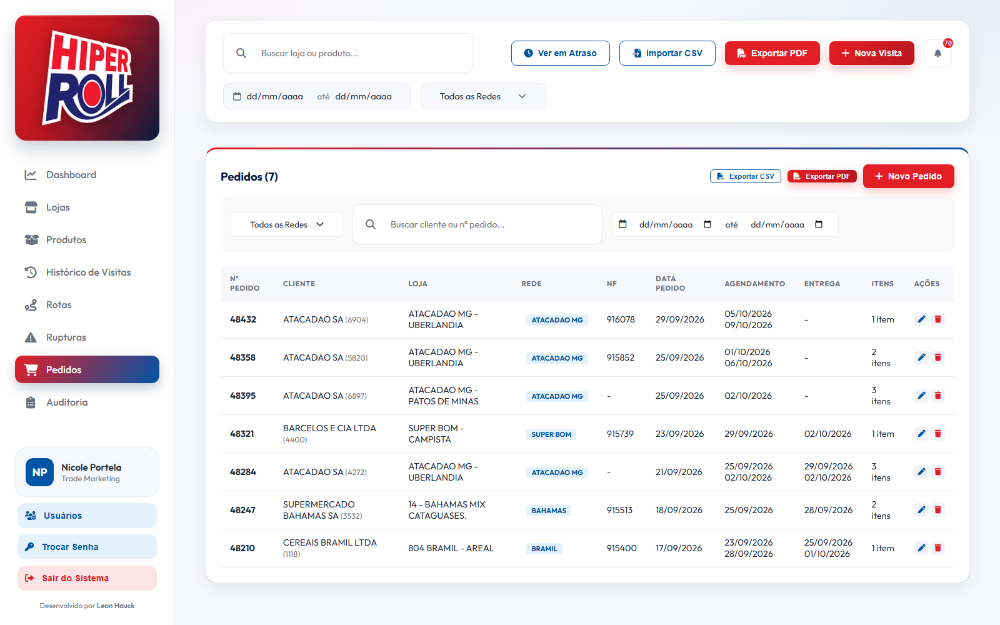

</td>
<td width="50%" valign="top">

**Cadastro e edição**

Busca de cliente por código, loja restrita às redes do cliente, até três datas de agendamento e de entrega, e itens do catálogo comercial.

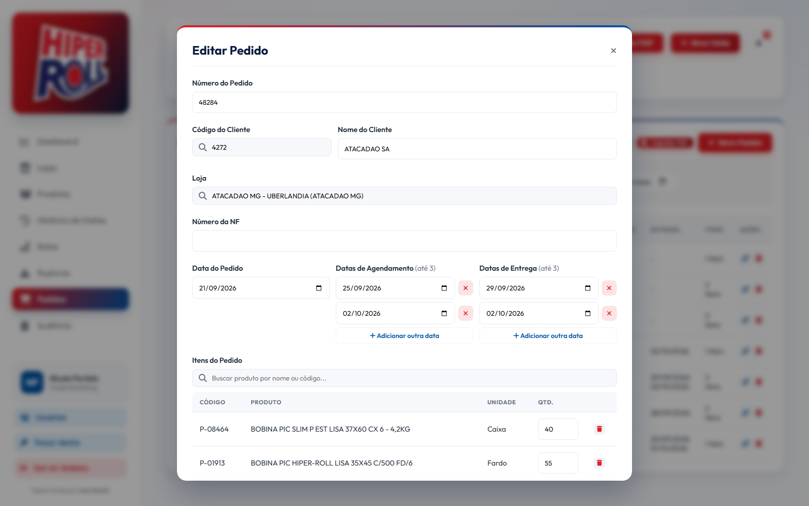

</td>
</tr>
</table>

### Auditoria

Registro de quem adicionou, editou ou excluiu cada coisa, com data e hora e o antes e depois de cada alteração. Visível só para administradores, com filtros por mês, usuário e aba.

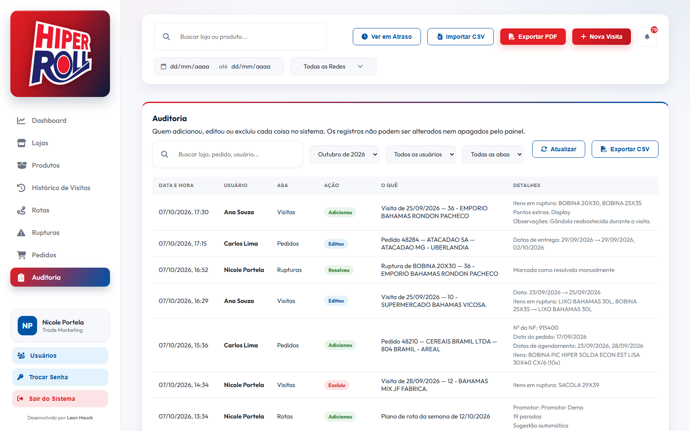

---

## Funcionalidades

### Dashboard

- Indicadores de lojas totais, visitas no período e taxa de ruptura.
- Status de cada loja calculado em janela móvel de 7 dias, conforme a frequência semanal esperada.
- Alertas de produtos em ruptura, com busca por loja e baixa manual (“Resolvido”).
- Ranking **TOP 5: Atenção**, que combina rupturas ativas e dias sem visita.
- Lista de **atraso crítico** para lojas há 14 dias ou mais sem visita.
- Filtros globais de período e rede, botão “Ver em Atraso” e central de notificações.
- PDF de lojas pendentes e em atraso, com gráficos e resumo executivo.

### Visitas

- Registro com data, checklist de itens em falta, pontos extras (Display, Clips Strips, Blacklight, Outros), fotos e observações.
- Marcação de **visita extra**.
- Resolução automática: quando um item deixa de ser apontado em uma visita posterior à mesma loja, a ruptura vai para o histórico de resolvidas.
- Edição de visita, alteração de data e exclusão individual ou em lote.

### Histórico de Visitas e relatórios

- Filtros combináveis: texto, período, rede, **produto com ruptura pendente**, ponto extra, observação, visita extra e ruptura.
- Tooltip com os itens em ruptura, sem precisar abrir o detalhe.
- **Exportação CSV** com os itens em ruptura, pontos extras e observações.
- **Exportação PDF** com os filtros aplicados, gráficos (status das visitas e top 5 produtos em ruptura), quadro de insights e a tabela completa.

### Rupturas

- Visão única de visitas e rupturas resolvidas, com filtro por status (todas, ativas ou resolvidas), rede e produto.
- Exportação em CSV e PDF.

### Rotas

- **Sugestão automática** de plano para 6 dias, priorizando lojas em atraso (peso 60%) e com rupturas ativas (peso 40%).
- **Montagem manual** por rede e loja, com reordenação das paradas e divisão entre os dias.
- Ordem de visita otimizada por vizinho mais próximo com refinamento 2-opt.
- Estimativa de tempo: 30 minutos por visita, mais 5 minutos por item cadastrado na loja, mais o deslocamento (média urbana de 28 km/h), dentro de uma jornada de 8 horas iniciada às 08:00.
- Distâncias calculadas a partir de coordenadas próprias (`store-geo.js`), sem API paga de mapas.
- Abertura da rota do dia no Google Maps e exportação do plano em PDF.

### Pedidos

- Cadastro com número do pedido, cliente, loja, nota fiscal, data do pedido e observações.
- Centros de distribuição podem ser o destino de um pedido sem contar como loja: aparecem só no campo "Loja" do pedido, fora de visitas, rotas e indicadores.
- Até três datas de agendamento e três de entrega por pedido, para pedidos entregues em partes. Todas aparecem na lista, no CSV e no PDF.
- Busca de cliente por código (`cd-clientes.js`), que preenche o nome e restringe a escolha de loja às redes daquele cliente.
- Itens escolhidos no catálogo comercial (`products-hiperroll.js`), com unidade de venda e quantidade.
- Exportação em CSV e PDF.

### Usuários

- Login individual, com nome e cargo exibidos na barra lateral.
- O cabeçalho de todos os PDFs traz como responsável quem estava logado ao exportar.
- Administradores cadastram, editam e excluem usuários e podem redefinir senhas pela janela **Usuários**.
- Cada pessoa troca a própria senha pelo botão **Trocar Senha**.
- Todos os usuários enxergam e alteram os mesmos dados.
- Várias pessoas podem usar o sistema ao mesmo tempo: o que uma grava aparece para as outras em até um minuto, sem recarregar a página, e ninguém sobrescreve o lançamento do colega.

### Auditoria

- O servidor registra, com usuário, data e hora: visitas e pedidos adicionados, editados e excluídos; baixas manuais de ruptura; planos de rota criados e excluídos; importações de CSV; limpeza de notificações; criação, alteração e exclusão de usuários; trocas de senha; e entradas no sistema.
- Nas edições, o registro guarda o valor de antes e o de depois de cada campo alterado. Nas exclusões, guarda o que foi apagado.
- A aba **Auditoria** é exclusiva de administradores, com busca, filtros por mês, usuário e aba, e exportação em CSV.
- Os registros só são acrescentados: não existe ação no sistema para editá-los ou apagá-los.

### Importação de dados

- **Importar CSV** adiciona lojas e produtos ao cadastro sem apagar o que já existe.
- Aceita vírgula ou ponto e vírgula como separador e reconhece as colunas pelo cabeçalho (loja, item ou produto, rede, status).

---

## Arquitetura

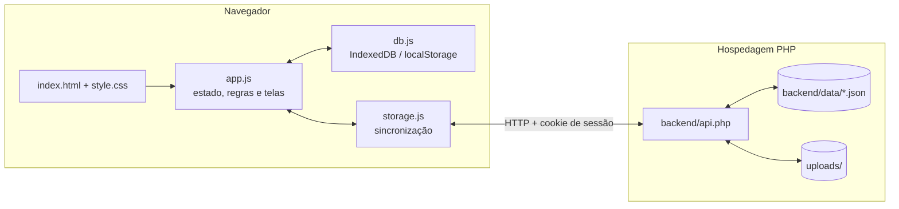

- **Cadastros fixos em arquivos JS.** Lojas e produtos ficam em `data.js`; coordenadas em `store-geo.js`; catálogo comercial em `products-hiperroll.js`; códigos de cliente em `cd-clientes.js`.
- **Persistência local.** `db.js` usa IndexedDB quando o sistema é servido por HTTP(S) e recorre ao `localStorage` quando aberto direto do arquivo.
- **Sincronização por diferenças.** `storage.js` guarda o último estado recebido do servidor e, ao gravar, envia só o que aquele usuário criou, alterou ou excluiu. O servidor aplica isso por cima do que já tem e devolve o estado completo, então uma tela desatualizada nunca apaga o que outro usuário gravou. Os planos de rota ficam apenas no navegador.
- **Atualização automática.** Com a tela visível, o painel consulta a versão dos dados a cada minuto, ao voltar para a aba e antes de cada gravação; só baixa o estado completo quando alguém gravou algo.
- **Gravações em fila.** O servidor usa uma trava para atender uma gravação por vez e troca cada arquivo de uma vez só, de modo que duas pessoas salvando no mesmo instante não corrompem nem perdem dados.
- **Tolerância a queda de conexão.** Uma alteração que não chegou ao servidor fica guardada no navegador e é reenviada na próxima sincronização ou na próxima abertura da página.
- **Backend sem banco de dados.** `backend/api.php` lê e grava arquivos JSON em `backend/data/` e salva as fotos em `uploads/`.
- **Login validado no servidor.** Usuário e senha são conferidos pelo `api.php`, que só responde a quem tem sessão aberta. Nenhuma credencial fica no código.
- **PDF desenhado nativamente.** Cabeçalhos, gráficos e tabelas são desenhados direto no jsPDF, em vez de capturar a tela como imagem. Isso mantém o arquivo leve, com texto pesquisável, e evita páginas em branco em relatórios com milhares de registros.
- **Consultas rápidas.** As visitas são indexadas por loja em memória, e as tabelas longas carregam de 50 em 50 registros.

---

## Tecnologias

| Camada | Tecnologia |
|---|---|
| Interface | HTML5, CSS3 e JavaScript puro (sem framework e sem build) |
| Gráficos | [Chart.js](https://www.chartjs.org/) |
| PDF | [html2pdf.js](https://github.com/eKoopmans/html2pdf.js) (jsPDF) |
| Ícones e fonte | Font Awesome 6 e Google Fonts (Outfit) |
| Persistência local | IndexedDB, com `localStorage` como alternativa |
| Backend | PHP 7.4+ com arquivos JSON |
| Hospedagem | Qualquer servidor com PHP (em produção na HostGator) |

---

## Estrutura do projeto

```
Trade-Marketing-HiperRoll/
├── index.html               # Estrutura da página, modais e carregamento dos scripts
├── style.css                # Identidade visual e layout responsivo
├── app.js                   # Estado, regras de negócio, telas e exportações
├── data.js                  # Cadastro de lojas e produtos
├── store-geo.js             # Coordenadas das lojas (aba Rotas)
├── products-hiperroll.js    # Catálogo comercial (aba Pedidos)
├── cd-clientes.js           # Código de cliente → redes atendidas (aba Pedidos)
├── db.js                    # Persistência local (IndexedDB / localStorage)
├── storage.js               # Sincronização com a API
│
├── backend/
│   ├── api.php              # Login, sessão e leitura/gravação dos dados
│   ├── setup.php            # Página única para criar o primeiro usuário (administrador)
│   ├── auth_config.php      # Leitura e gravação dos usuários no config.php
│   ├── config.example.php   # Modelo do config.php (o arquivo real não é versionado)
│   ├── test_write.php       # Diagnóstico de permissão de escrita no servidor
│   └── .htaccess            # Bloqueia o acesso direto aos dados e ao config.php
│
├── uploads/                 # Fotos das visitas (conteúdo não versionado)
├── docs/screenshots/        # Imagens usadas neste README
├── serve.ps1                # Servidor estático local em PowerShell
├── README-local-server.md   # Instruções do servidor local
├── SECURITY.md              # Cuidados com credenciais
└── LICENSE
```

---

## Como executar localmente

**Pré-requisitos:** um navegador atual. Para testar a sincronização com o servidor, também é necessário PHP 7.4 ou superior.

1. Clone o repositório:

   ```bash
   git clone https://github.com/LeonHauck/Trade-Marketing-HiperRoll.git
   cd Trade-Marketing-HiperRoll
   ```

2. Suba um servidor na pasta do projeto.

   Somente a interface (Windows, sem instalar nada):

   ```powershell
   powershell -NoProfile -ExecutionPolicy Bypass -File .\serve.ps1 -Port 8000
   ```

   Interface e backend (com PHP instalado):

   ```bash
   php -S localhost:8000
   ```

3. Acesse `http://localhost:8000`.

Com o backend PHP, abra antes `http://localhost:8000/backend/setup.php` para criar o usuário e a senha de teste.

Sem o backend PHP, o sistema abre em modo local: aceita qualquer login e guarda os dados apenas no navegador. Esse modo só existe em `localhost` ou ao abrir o `index.html` direto do disco.

---

## Publicação em produção

1. Envie todos os arquivos para a pasta pública da hospedagem.
2. Abra `https://seu-dominio/backend/setup.php` e crie o primeiro usuário, que será o administrador. A página grava `backend/config.php` no servidor e se bloqueia em seguida. Os demais usuários são criados dentro do painel, na janela **Usuários**.
3. Garanta permissão de escrita para o PHP em `backend/`, `backend/data/` e `uploads/`. As pastas de dados são criadas automaticamente no primeiro acesso.
4. Abra `backend/test_write.php` no navegador para confirmar que a gravação funciona.
5. Ao publicar uma nova versão, atualize o sufixo `?v=` dos scripts e do CSS no `index.html` para que os navegadores não usem a cópia em cache.

Para trocar a senha, use o botão **Trocar Senha** na barra lateral do painel: ele pede a senha atual e a nova. Os outros aparelhos conectados precisam entrar de novo.

Se alguém esquecer a senha, um administrador define outra na janela **Usuários**. Se o único administrador esquecer a dele, apague `backend/config.php` pelo gerenciador de arquivos da hospedagem e abra o `setup.php` novamente; nesse caso os outros usuários precisam ser recriados.

---

## API do backend

Todas as chamadas vão para `backend/api.php?action=<ação>`. Fora `login`, `logout` e `session`, todas exigem o cookie de sessão criado no login e respondem `401` sem ele.

| Ação | Método | Descrição |
|---|---|---|
| `login` | POST | Confere usuário e senha e abre a sessão |
| `logout` | POST | Encerra a sessão |
| `change_password` | POST | Troca a própria senha, conferindo a atual, e encerra as outras sessões do usuário |
| `users_list` | GET | Lista os usuários (somente administrador) |
| `user_save` | POST | Cria ou altera um usuário: nome, cargo, permissão e senha (somente administrador) |
| `user_delete` | POST | Exclui um usuário e encerra as sessões dele (somente administrador) |
| `audit_log` | GET | Registros de auditoria de um mês (somente administrador) |
| `audit_event` | POST | Registra na auditoria uma ação que só existe no navegador (plano de rota, importação de CSV) |
| `session` | GET | Informa se a sessão do navegador ainda é válida |
| `load` | GET | Retorna todo o estado: visitas, rupturas, histórico, pedidos, status das lojas, fotos e a versão dos dados |
| `version` | GET | Retorna só a versão dos dados, para o painel saber se há novidades |
| `sync` | POST | Aplica as alterações enviadas (itens criados, alterados e excluídos) e devolve o estado atualizado |
| `upload_photo` | POST | Envia uma foto de visita |
| `delete_photos` | POST | Remove as fotos de uma visita |

As ações `save_*` e `delete_*` de versões anteriores continuam no código apenas para abas que ficaram abertas com o painel antigo.

---

## Segurança

- **Login no servidor.** O `backend/api.php` confere usuário e senha e abre uma sessão. Sem sessão válida, nenhuma ação de leitura ou gravação responde.
- **Usuários individuais.** Cada pessoa tem login e senha próprios. Só administradores gerenciam usuários, e o servidor confere essa permissão a cada chamada.
- **Senha fora do código.** Os usuários e os hashes das senhas ficam em `backend/config.php`, criado pelo `setup.php` direto no servidor. O arquivo está no `.gitignore` e a senha nunca é gravada em texto puro.
- **Sessão.** Cookie `HttpOnly` e `SameSite=Lax` (e `Secure` sob HTTPS), válido por 30 dias sem uso. Trocar a senha encerra as sessões abertas.
- **Troca de senha.** Feita no próprio painel, exige a senha atual e encerra as sessões dos outros aparelhos.
- **Tentativas de login.** Após 8 senhas erradas do mesmo IP (no login ou na troca de senha), o acesso fica bloqueado por 15 minutos.
- **Auditoria.** Cada alteração fica registrada no servidor com o usuário que a fez, em arquivos mensais dentro de `backend/data/`. Senhas nunca são gravadas nos registros.
- **Mesma origem.** A API não envia cabeçalhos de CORS: só o próprio site consegue chamá-la.
- **Limites conhecidos.** Todos os usuários têm acesso aos mesmos dados; não há permissões por tela. As fotos em `uploads/` são servidas por endereço direto, sem passar pelo login.

Mais orientações em [SECURITY.md](./SECURITY.md).

---

## Solução de problemas

| Sintoma | O que verificar |
|---|---|
| Alterações não aparecem após publicar | Atualize o sufixo `?v=` no `index.html` ou recarregue com Ctrl+F5 |
| Lançamento de um colega não aparece | Aguarde até um minuto ou recarregue a página; se persistir, saia e entre de novo e confirme que `backend/data/` aceita escrita |
| Erro “Arquivo de dados ilegível no servidor” | Um arquivo de `backend/data/` está corrompido; restaure-o de um backup. O sistema não grava por cima para não perder o conteúdo |
| Fotos não são salvas | Verifique a permissão de escrita em `uploads/` com `backend/test_write.php` |
| Tela de login diz “Sistema ainda não configurado” | Falta o `backend/config.php`: abra `backend/setup.php` e defina usuário e senha |
| Login bloqueado por excesso de tentativas | Aguarde 15 minutos ou apague `backend/data/login_attempts.json` no servidor |
| Alguém esqueceu a senha | Um administrador define outra na janela **Usuários** |
| O único administrador esqueceu a senha | Apague `backend/config.php` no servidor e abra `backend/setup.php` novamente (os outros usuários precisam ser recriados) |
| PDF não é gerado | Verifique se o navegador conseguiu carregar Chart.js e html2pdf.js (dependem de acesso à internet) |
| Aviso de “Erro de Script” ao abrir do disco | Use um servidor local em vez de abrir o arquivo diretamente |

---

## Autor e licença

Desenvolvido por **[Leon Hauck](https://www.linkedin.com/in/leon-hauck/)** para a **HiperRoll Embalagens**.
Em produção desde junho de 2026, com evolução contínua.

Distribuído sob a licença [MIT](./LICENSE).
